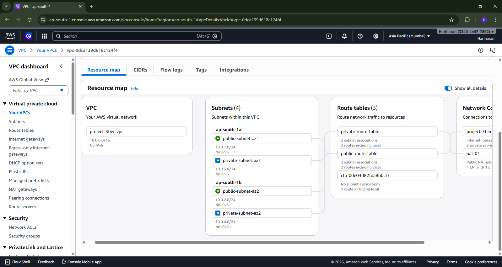
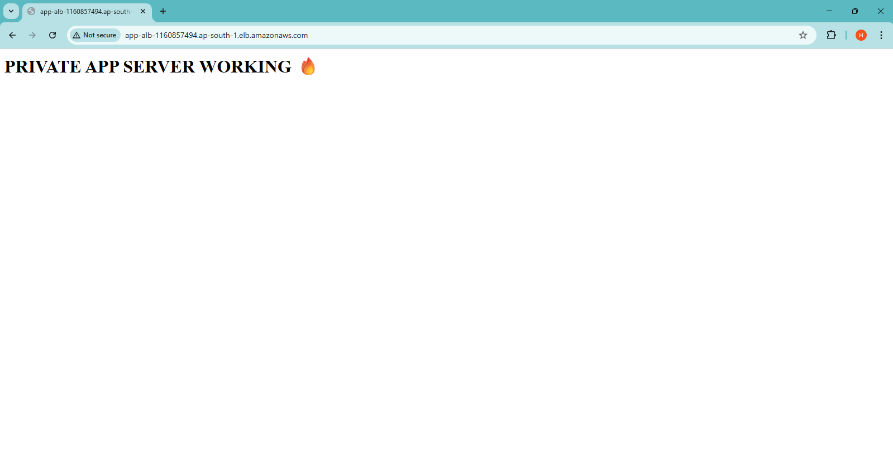
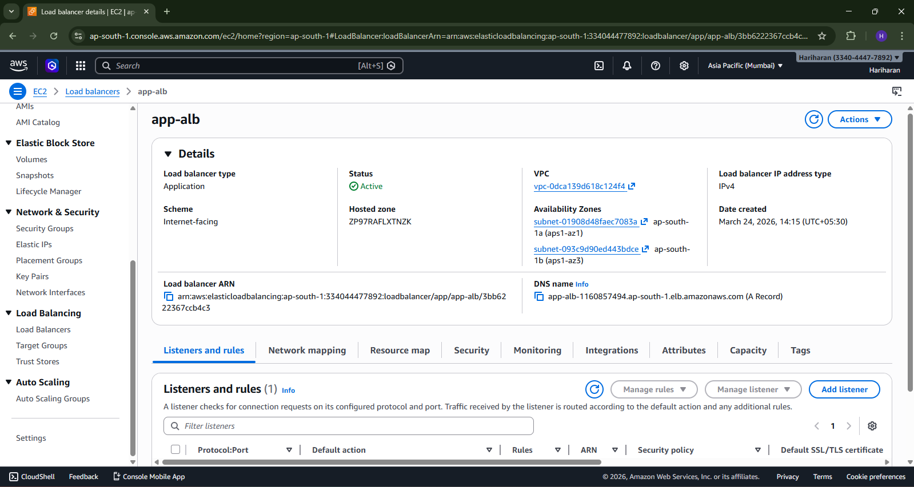
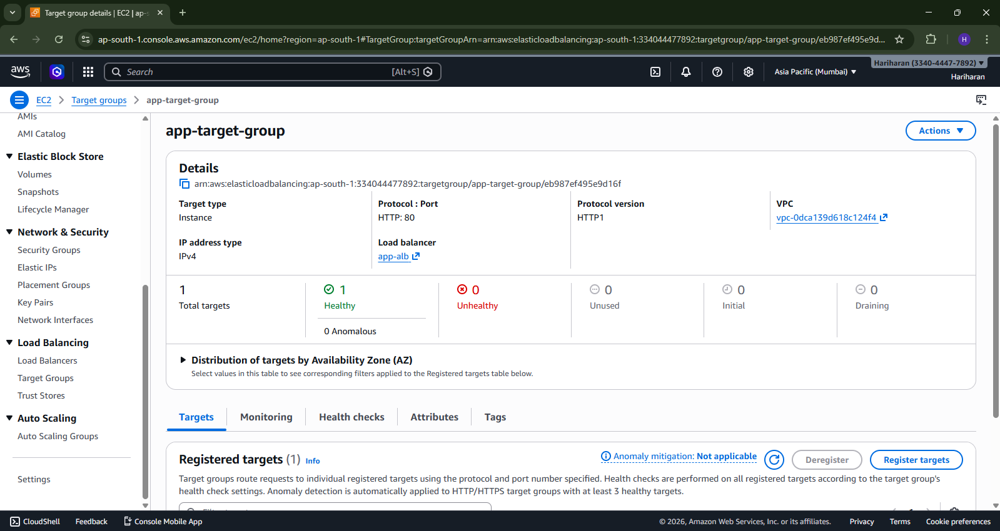
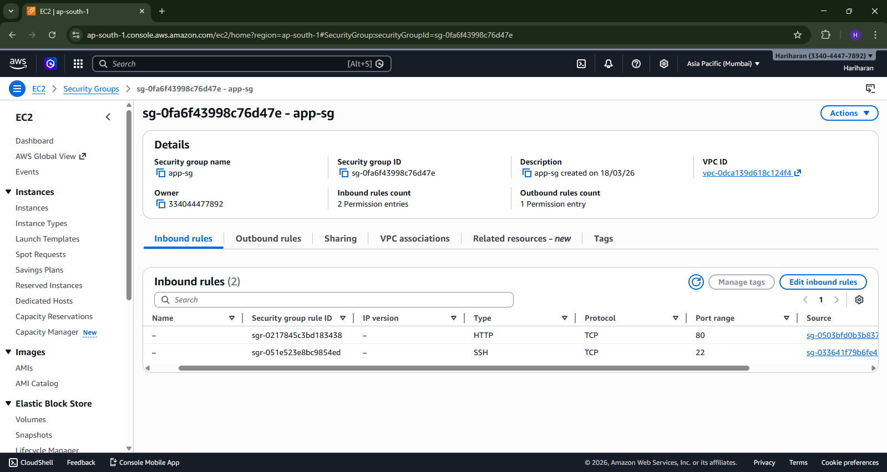
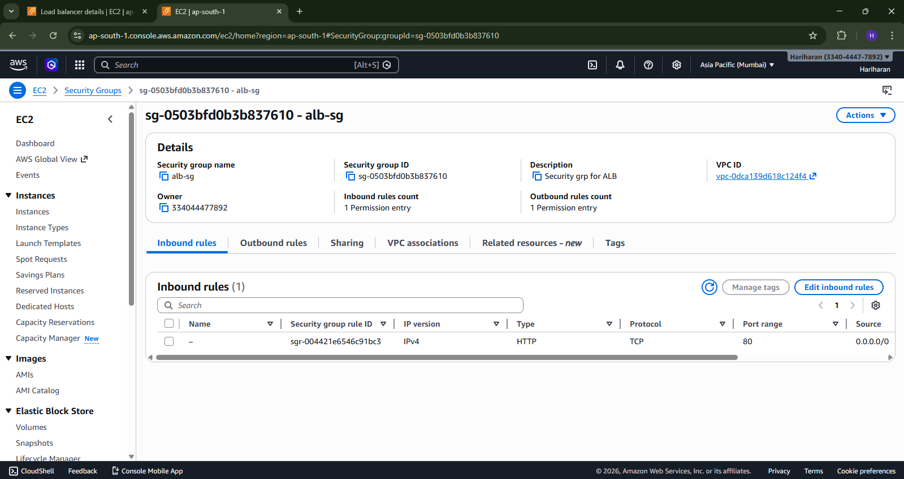
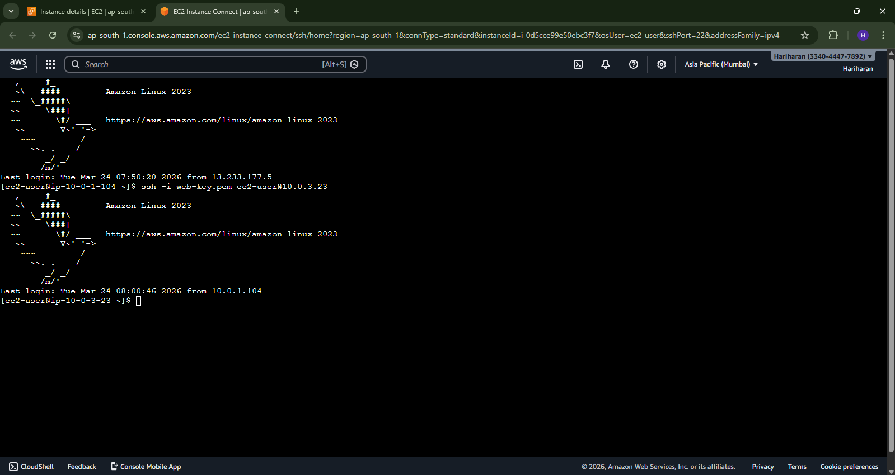

# 🚀 AWS Secure 3-Tier Architecture

## 📌 Overview

This project demonstrates a production-style secure 3-tier architecture on AWS using public and private subnets, a bastion host, and an Application Load Balancer.

The architecture ensures secure access to private resources while allowing controlled public traffic.

---

## 🏗️ Architecture Diagram

---

## ⚙️ Services Used

* Amazon VPC
* EC2 (Public & Private Instances)
* Application Load Balancer (ALB)
* NAT Gateway
* Internet Gateway
* Security Groups

---

## 🔐 Architecture Flow

* User sends request to Application Load Balancer
* ALB routes traffic to private EC2 (App Server)
* App server is not publicly accessible
* Bastion host (public EC2) is used for SSH access
* NAT Gateway allows outbound internet access from private subnet

---

## 📸 Screenshots

### 🔹 Application Output

### 🔹 Load Balancer

### 🔹 Target Group Health

### 🔹 App Security Group

### 🔹 ALB Security Group

### 🔹 Bastion SSH Access

---

## 🧠 Key Learnings

* Designed a secure AWS architecture using public and private subnets
* Implemented bastion host pattern for secure access
* Configured Application Load Balancer and target groups
* Understood security group-based access control
* Debugged real issues like:

  * Target group unhealthy state
  * Security group misconfiguration
  * SSH connectivity issues

---

## 💡 Conclusion

This project helped me understand real-world cloud architecture, networking, and security practices in AWS.
